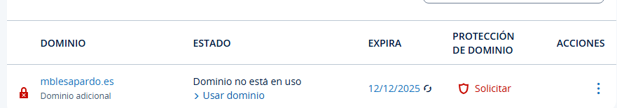
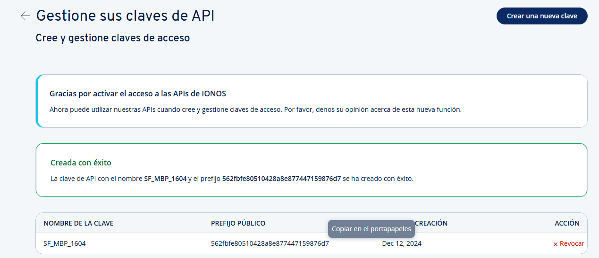
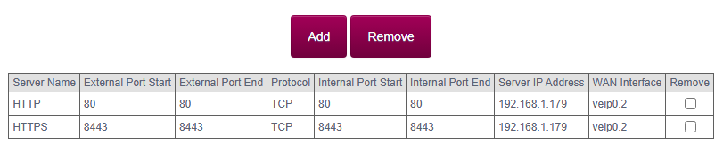

# Self-hosting

## Registro del dominio
Para esta práctica se ha decidido comprar el dominio **mblesapardo.es** en **IONOS**.


## Estructura inicial de la máquina virtual
1. Utilizando **vagrant** crearemos la máquina virtual con una estructura parecida a esta y **creando un archivo _provision.sh_** para las provision:

```

Vagrant.configure("2") do |config|
  config.vm.box = "debian/bookworm64"
  config.vm.hostname = "selfhosting-debian"
  
  config.vm.network "forwarded_port", guest: 80, host: 8080
  config.vm.network "forwarded_port", guest: 443, host: 8443

  config.vm.network "public_network", bridge: "en0"

  config.vm.provision "shell", inline: <<-SHELL

  SHELL

end

```

2. Instalamos **cron**, **curl** y **apache** mediante la provision, quedando así:

```

config.vm.provision "shell", inline: <<-SHELL

    # Actualizamos los repositorios
    sudo apt update -y

    # Instalamos apache y curl
    sudo apt-get install -y apache2 curl cron

    # Habilitamos el inicio automático de apache y de cron
    sudo systemctl enable apache2
    sudo systemctl enable cron

SHELL

```

## Configuración del servidor DynDNS
En este paso configuraremos el **servidor DynDNS** mediante nuestro proveedor IONOS. Para ello:

1. Accederemos al panel del desarrollador de nuestro proveedor para generar un **token de autorización (API Key)**.

- En el menú del panel, seleccionaremos **"Dominios y SSL"** y haremos clic en **"Abrir portal API"**.
- Iremos a la sección de **"Gestion de claves API"** y crearemos una nueva clave, aclarar que si no estás suscrito al servicio, deberás hacerlo (es gratuito).
- Guardaremos el prefijo público y el secreto en un archivo protegido.

Si todo ha salido bien veremos lo siguiente:


2. Configuraremos el DNS Dinámico utilizando el **cliente multiplataforma de Python** que **IONOS** pone a disposición de los usuarios.

- Ahora entraremos **en la máquina Debian** y ejecutaremos el siguiente comando:

```

curl -X 'POST' \
  'https://api.hosting.ionos.com/dns/v1/dyndns' \
  -H 'accept: application/json' \
  -H 'X-API-Key: cfc9240805.cbx1K2HT9OhPVZGnavYlMsJIrCdut6Dg' \
  -H 'Content-Type: application/json' \
  -d '{
    "domains": [
      "mblesapardo.es",
      "www.mblesapardo.es"
    ],
    "description": "DNS dinámico"
  }'


```

- Si todo ha salido bien, deberíamos tener una respuesta como esta:

```

{"bulkId":"e7ed93cd-b528-4a3e-8f55-139b4eecd3d1",
"updateUrl":"https://ipv4.api.hosting.ionos.com/dns/v1/dyndns?q=NWI0NzRlZjdkMjEyNDlhMzg3Y2IzODM2NTY0OGYwYjguM3RJUmFfOE9JQVNJX0NxdXgzN0IzR1I2dWxjd2ZaWW9DT0ltNURSd1BrM281Tld4Q3phSHJPakRpTUx2RDlKM0hGbDktV29XcDdJNnhScFVYTjJkM0E",
"domains":["mblesapardo.es","www.mblesapardo.es"],
"description":"DNS dinámico"}vagrant@selfhosting-debian:~$

```

- Seguido de esto, procederemos a abrir el contrab de nuestro servidor con el comando _contrab -e_ y agregaremos la siguiente línea:

```

*/5 * * * * curl "https://ipv4.api.hosting.ionos.com/dns/v1/dyndns?q=NWI0NzRlZjdkMjEyNDlhMzg3Y2IzODM2NTY0OGYwYjguM3RJUmFfOE9JQVNJX0NxdXgzN0IzR1I2dWxjd2ZaWW9DT0ltNURSd1BrM281Tld4Q3phSHJPakRpTUx2RDlKM0hGbDktV29XcDdJNnhScFVYTjJkM0E"

```

Hecho esto, ya tendremos nuestro servidor DNS Dinámico configurado.

## Redirección de los puertos en el router

Para redirigir los puertos en nuestro router (en este caso de Movistar) tendremos que seguir los siguientes pasos:

1. Primero que todo, accederemos a la **configuración de nuestro router**. Para ello, abrimos el navegador y entramos en **nuestra dirección IP** (normalmente 192.168.1.1 o 192.168.0.1).
2. Entraremos en la **sección de Configuración Avanzada** y buscaremos un apartado de **redirección de puertos**, **NAT**, **Virtual Server** o **Puertos**.
3. Agregaremos una nueva regla de redirección para el **puerto 80** y para el **puerto 8443** redirigiendo el tráfico a la IP de nuestro servidor (192.168.1.179). Tal que así:


🚨 **¡¡¡EN ESTA CONFIGURACIÓN SE HA USADO EL PUERTO 8443 DEBIDO A QUE EL PUERTO 443 DE MI ROUTER YA ESTABA EN USO!!!** 🚨

## Configuración del Servidor Web de apache
Ahora que ya tenemos todo configurado, sólo nos queda configurar el servidor web. Para ello, realizaremos los siguientes pasos:

1. Crearemos la carpeta mblesapardo.es en local, para añadir todos los archivos necesarios para la configuración del sitio web, teniendo una estructura tal que:

```

/mis_archivos_vagrant/
├── sitio_web/
│   ├── index.html
│   ├── 404.html
│   ├── logs/
│   └── apache2.conf

```

- El index quedará tal que así:

```

<!DOCTYPE html>
<html lang="es">
<head>
    <meta charset="UTF-8">
    <meta name="viewport" content="width=device-width, initial-scale=1.0">
    <title>Bienvenido a mblesapardo.es</title>
    <style>
        body {
            font-family: Arial, sans-serif;
            background-color: #f4f4f9;
            color: #333;
            text-align: center;
            padding: 50px;
        }
        h1 {
            color: #4CAF50;
        }
        p {
            font-size: 18px;
            margin-top: 20px;
        }
        .container {
            background-color: white;
            padding: 30px;
            border-radius: 8px;
            box-shadow: 0 0 10px rgba(0, 0, 0, 0.1);
            width: 60%;
            margin: 0 auto;
        }
    </style>
</head>
<body>

    <div class="container">
        <h1>¡Bienvenido a mblesapardo.es!</h1>
        <p>Este es el sitio web que estás sirviendo con Nginx. ¡Todo está funcionando correctamente!</p>
        <p>Si llegaste hasta aquí, significa que tu servidor web está configurado correctamente.</p>
    </div>

</body>
</html>


```

- La página de errores:

```

<!-- 404.html -->
<html>
<head>
    <title>404 - Página no encontrada</title>
</head>
<body>
    <h1>404 - Página no encontrada</h1>
    <p>Lo sentimos, no pudimos encontrar la página que buscas.</p>
</body>
</html>

```

- La configuración de apache.conf:

```

<VirtualHost *:80>
    DocumentRoot /var/www/html
    ServerName mblesapardo.es
    ErrorLog ${APACHE_LOG_DIR}/error.log
    CustomLog ${APACHE_LOG_DIR}/access.log combined

    # Páginas de error personalizadas
    ErrorDocument 404 /404.html
</VirtualHost>

```

- La provisión debería quedar con las siguientes líneas añadidas:

```

# Copiamos los archivos del sitio web a la máquina virtual
sudo cp -r /vagrant/mblesapardo.es/* /var/www/html/
sudo cp /vagrant/mblesapardo.es/apache2.conf /etc/apache2/sites-available/000-default.conf

# Asignamos los permisos adecuados
sudo chown -R www-data:www-data /var/www/html/
sudo chmod -R 755 /var/www/html/

```

2. Ahora vamos a generar los certificados SSL con Let's Encrypt. Para ello necesitaremos instalar **certbot**

3. Configuramos apache para que escuche los puertos 80 y 8443. Para ello ejecutaremos en la máquina y añadiremos:

```

sudo nano /etc/apache2/ports.conf

# Se añadirá al archivo
Listen 80
Listen 8443

```

- Añadimos el puerto 8443 al archivo de configuración de ssl:

```

<VirtualHost *:80>
    DocumentRoot /var/www/html
    ServerName mblesapardo.es
    ErrorLog ${APACHE_LOG_DIR}/error.log
    CustomLog ${APACHE_LOG_DIR}/access.log combined

    # Página de error personalizada
    ErrorDocument 404 /404.html
</VirtualHost>

<Directory /var/www/html/.well-known>
    AllowOverride None
    Options None
    Require all granted
</Directory>

```

- Habilitamos el sitio SSL en Apache y actualizamos la provision, quedando así:

```

# Copiamos los archivos del sitio web a la máquina virtual
sudo cp -r /vagrant/mblesapardo.es/* /var/www/html/
sudo cp /vagrant/mblesapardo.es/apache2.conf /etc/apache2/sites-available/000-default.conf
sudo cp /vagrant/mblesapardo.es/apache2-https.conf /etc/apache2/sites-available/default-ssl.conf

# Asignamos los permisos adecuados
sudo chown -R www-data:www-data /var/www/html/
sudo chmod -R 755 /var/www/html/

# Habilitamos SSL en Apache
sudo a2enmod ssl
sudo a2ensite default-ssl.conf

        
# Reiniciamos Apache para aplicar los cambios
sudo systemctl restart apache2

```